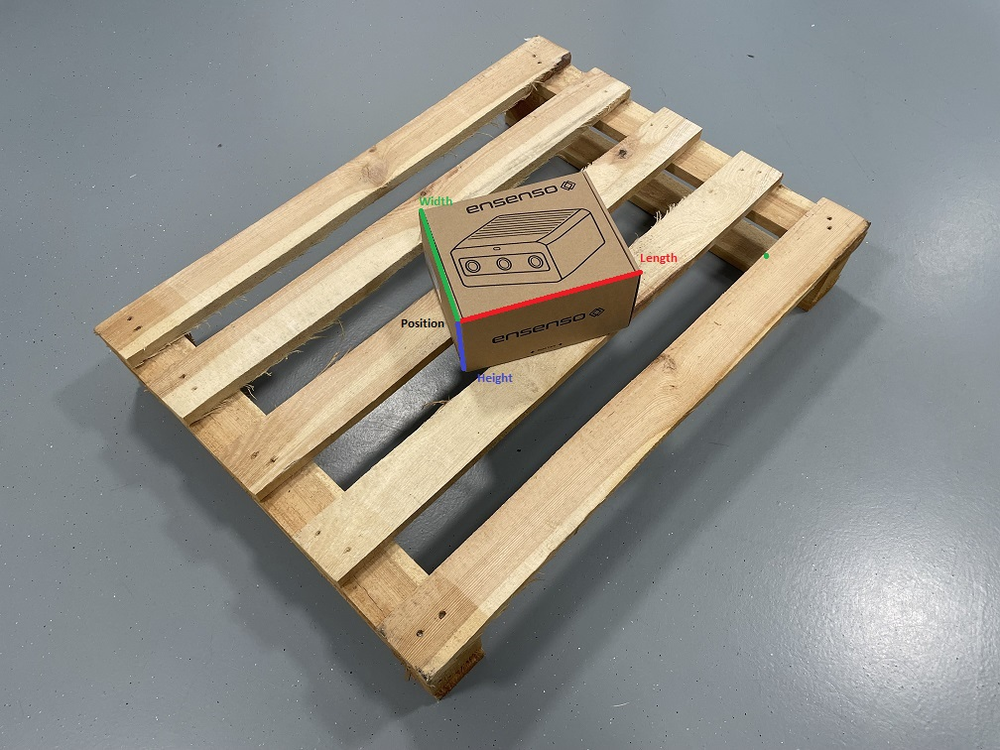
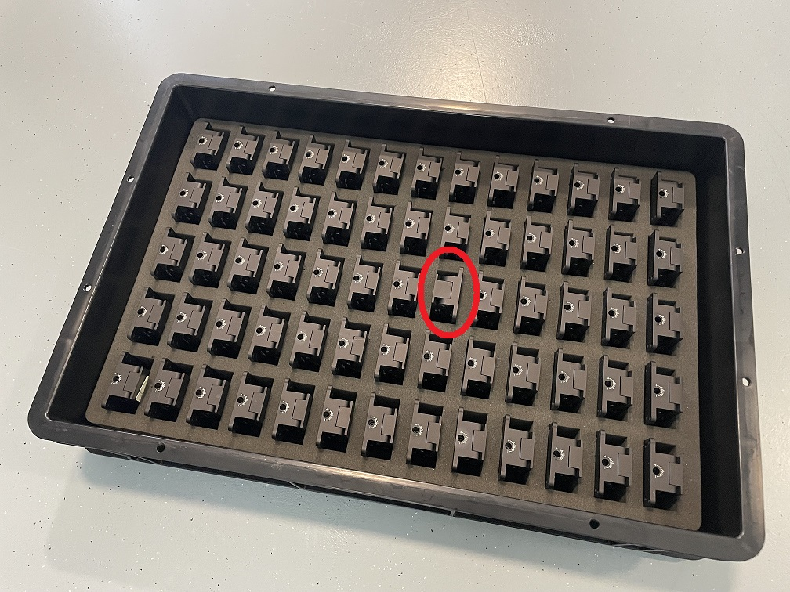

# Ensenso Application Examples

This repository contains a few examples to give you an idea of how Ensenso cameras and software may be used in your application.

## Requirements

You'll need a **_Python_** installation that is also capable of running **_Jupyter_** notebooks. To set up the **_Python_** environment with the necessary packages, you can use the provided `requirements.txt` and the command

```bash
pip install -r requirements.txt
```

Furthermore you need to install the **_Ensenso SDK_**, which you can download from https://ensenso.com/download.

## List of Examples

<table>
    <tr><td></td><td><b>Description</b></td><td><b>Key Learnings</b></td><td><b>Level</b></td></tr>
    <tr>
        <td></td>
        <td>
            <b>Measure Boxes</b><br>Using an orthographic projection of the point cloud, we measure the dimensions, position and rotation of singular boxes on a palette.
            Check it out here: <a href="measure_boxes/measure_boxes.ipynb">measure_boxes.ipynb</a>.
        </td>
        <td>
            <ul>
                <li>Workspace Calibration</li>
                <li>Basic Capturing</li>
                <li>Using Projections</li>
                <li>OpenCV: Detect Contours</li>
            </ul> 
        </td>
        <td>Beginner</td>
    </tr> 
    <tr>
        <td></td>
        <td>
            <b>Check Items in a Tray</b><br>By implementing a simple pattern matching algorithm, we check if the items in a tray are placed in a specific orientation.
            Check it out here: <a href="check_tray_placement/check_tray_placement.ipynb">check_tray_placement.ipynb</a>.
        </td>
        <td>
            <ul>
                <li>Capture, Workspace Calibration and Projections</li>
                <li>2-Way Thresholding</li>
                <li>OpenCV: Connected Components</li>
                <li>Naive Template Matching</li>
            </ul> 
        </td>
        <td>Intermediate</td>
    </tr>
</table>
